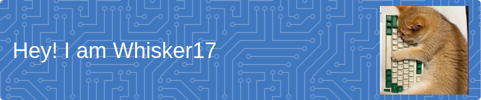
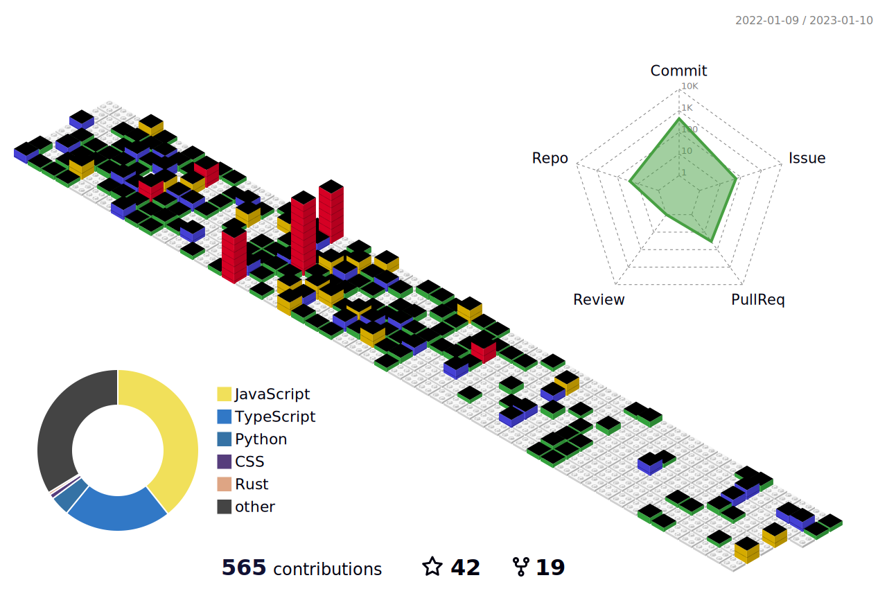

<h1 align="center">  </h1>

  

- 🔭 I’m currently working on [**Zeitgeist**](https://zeitgeist.pm/)

- 🌱 I’m currently learning **Futarchy,zkSNARKs,zkSTARKs**

- 👨‍💻 All of my projects are available at [**https://github.com/Whisker17**](https://github.com/Whisker17)

- 📫 How to reach me **whisker17@zeitgeist.pm**

<h3 align="left">Connect with me</h3>

 

### Recent Activity

<!--START_SECTION:activity-->

1. 🗣 Commented on [#45](https://github.com/zeitgeistpm/documentation/issues/45) in [zeitgeistpm/documentation](https://github.com/zeitgeistpm/documentation)
2. ❌ Closed PR [#44](https://github.com/zeitgeistpm/documentation/pull/44) in [zeitgeistpm/documentation](https://github.com/zeitgeistpm/documentation)
3. 💪 Opened PR [#44](https://github.com/zeitgeistpm/documentation/pull/44) in [zeitgeistpm/documentation](https://github.com/zeitgeistpm/documentation)
4. 💪 Opened PR [#43](https://github.com/zeitgeistpm/documentation/pull/43) in [zeitgeistpm/documentation](https://github.com/zeitgeistpm/documentation)
5. 🎉 Merged PR [#662](https://github.com/zeitgeistpm/zeitgeist/pull/662) in [zeitgeistpm/zeitgeist](https://github.com/zeitgeistpm/zeitgeist)
<!--END_SECTION:activity-->

📈 My GitHub Stats

 

  
 

📊 My Langs Stats

 

🏆GitHub Trophies

 

### 💻Tech Stack

<!-- Program language -->

<!-- Host -->

<!-- Tools -->

<!-- DB -->

<!-- Devops -->

<!-- Blockchain  -->

<!-- Version control -->

